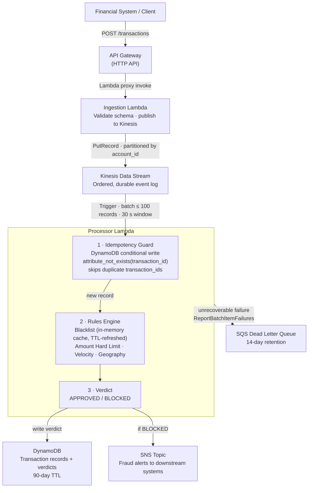

# Fraud Detection Pipeline

A real-time, event-driven fraud detection pipeline built for enterprise financial systems. Transactions are ingested via REST API, streamed through Amazon Kinesis, evaluated by a pure rules-based detection engine, and persisted in DynamoDB — all on a fully serverless AWS architecture with production-grade reliability patterns.

---

## Architecture Overview



### Component Responsibilities

| Component | Service | Role |
|---|---|---|
| REST Ingestion | API Gateway (HTTP API) + Lambda | Accept transactions, validate schema, publish to stream |
| Event Stream | Amazon Kinesis Data Streams | Ordered, durable buffer between ingestion and processing |
| Fraud Processor | AWS Lambda (Kinesis trigger) | Batched rule evaluation with idempotency and DLQ |
| Transaction Store | Amazon DynamoDB | Low-latency storage for transactions and fraud verdicts |
| Dead Letter Queue | Amazon SQS | Captures unrecoverable processing failures for inspection |
| Alerting | Amazon SNS | Fan-out notifications for blocked transactions |

---

## Project Structure

```
fraud-pipeline/
├── README.md
├── pyproject.toml
├── requirements.txt
├── requirements-dev.txt
│
├── src/
│   ├── ingestion/
│   │   └── handler.py          # Lambda: API Gateway → Kinesis
│   ├── processor/
│   │   └── handler.py          # Lambda: Kinesis consumer, idempotency, DLQ routing
│   ├── detection/
│   │   └── rules.py            # Rules engine: blacklist (cached), velocity,
│   │                           #   geography, amount limit
│   ├── storage/
│   │   └── dynamodb.py         # DynamoDB operations including idempotent put
│   ├── alerting/
│   │   └── sns.py              # SNS publish for fraud alerts
│   └── common/
│       ├── models.py           # Pydantic schemas (Transaction, FraudVerdict, etc.)
│       ├── config.py           # Environment-driven configuration
│       └── logging.py          # Structured JSON logger
│
├── infrastructure/
│   └── cloudformation/
│       ├── api-gateway.yaml    # HTTP API (v2), Lambda proxy integration
│       ├── kinesis.yaml        # Stream, shard count, retention
│       ├── lambda.yaml         # Both Lambdas, IAM roles, Kinesis trigger, SQS DLQ
│       ├── dynamodb.yaml       # Table, GSI, TTL, capacity settings
│       └── sns.yaml            # Fraud alert topic, optional email subscription
│
├── scripts/
│   ├── deploy.sh               # Build + upload Lambda zip + deploy all stacks
│   └── load_test.py            # Load testing script
│
└── tests/
    ├── unit/
    │   ├── test_detection/     # Rules engine, blacklist cache
    │   ├── test_storage/       # DynamoDB idempotent write
    │   └── test_ingestion/     # Ingestion handler unit tests
    └── integration/
        └── test_pipeline.py    # End-to-end flow (moto)
```

---

## Data Flow

1. **Ingest** — A financial system POSTs a transaction JSON to API Gateway.
2. **Validate & Publish** — The Ingestion Lambda validates the schema (Pydantic), and writes the event to a Kinesis shard partitioned by `account_id` (preserving per-account ordering).
3. **Batch Consume** — The Processor Lambda is triggered per-shard in batches (default: 100 records, 30 s window).
4. **Idempotency check** — Before scoring, a DynamoDB conditional write (`attribute_not_exists(transaction_id)`) atomically claims the record. Duplicates from Kinesis at-least-once delivery are detected and silently skipped.
5. **Score** — Each transaction is evaluated by the rules engine:
   - *Blacklist*: merchant/account ID checked against an in-memory cache (refreshed from DynamoDB on TTL expiry).
   - *Amount limit*: hard ceiling per transaction.
   - *Velocity*: transaction count for the account within a rolling time window (GSI query).
   - *Geography*: Haversine distance / elapsed time; flags impossible travel speeds.
6. **Persist** — The transaction record and verdict are written to DynamoDB (`transactions` table).
7. **Alert** — `BLOCKED` transactions trigger an SNS publish; downstream subscribers handle notification.
8. **DLQ** — Records that fail with an unhandled exception are sent to the SQS DLQ. Lambda's partial batch response (`ReportBatchItemFailures`) ensures only failed records are retried, not the entire batch.

---

## Key Design Decisions

| Decision | Rationale |
|---|---|
| Pure rules engine (no ML) | Deterministic, auditable, zero cold-start model loading; rules are tunable without redeployment via environment variables |
| In-memory blacklist cache | Eliminates one DynamoDB read per transaction for the most frequent check; TTL-based refresh keeps data fresh within an acceptable staleness window |
| Idempotent DynamoDB write | Kinesis guarantees at-least-once delivery; the conditional `attribute_not_exists` expression makes the check-and-write atomic without a separate read |
| Partial batch response | `ReportBatchItemFailures` lets Lambda retry only the specific failed records within a batch, avoiding duplicate processing of successfully handled records |
| DLQ (SQS) for failures | Unrecoverable records are preserved for inspection and reprocessing rather than silently dropped; 14-day retention |
| Kinesis over SQS | Ordered, replayable event log; supports multiple independent consumers (audit, analytics) without message deletion |
| DynamoDB over RDS | Single-digit millisecond reads at scale; no cold-start connection overhead in Lambda |
| Partition key = account_id | Keeps all events for an account on the same shard, preserving order for velocity and geography checks |

---

## Prerequisites

- Python 3.12+
- AWS CLI configured (`aws configure`)
- An AWS account with permissions for Lambda, Kinesis, DynamoDB, API Gateway, SNS, SQS, and IAM

---

## Getting Started

```bash
# 1. Install dependencies
pip install -r requirements.txt

# 2. Run tests
pytest tests/

# 3. Deploy all infrastructure
#    Creates the S3 artifact bucket, builds and uploads the Lambda zip,
#    then deploys all five stacks in dependency order.
bash scripts/deploy.sh

# 4. Submit a test transaction
URL=$(aws cloudformation describe-stacks \
  --stack-name fraud-pipeline-api-gateway \
  --query "Stacks[0].Outputs[?OutputKey=='TransactionsUrl'].OutputValue" \
  --output text --region us-east-1)

curl -X POST "$URL" \
  -H "Content-Type: application/json" \
  -d '{
    "transaction_id": "txn_001",
    "account_id": "acct_123",
    "amount": 4500.00,
    "merchant_id": "merch_789",
    "currency": "USD",
    "country_code": "US"
  }'
```

### Stack deployment order (if deploying individually)

```bash
aws cloudformation deploy --template-file infrastructure/cloudformation/kinesis.yaml \
  --stack-name fraud-pipeline-kinesis --region us-east-1

aws cloudformation deploy --template-file infrastructure/cloudformation/dynamodb.yaml \
  --stack-name fraud-pipeline-dynamodb --region us-east-1

aws cloudformation deploy --template-file infrastructure/cloudformation/sns.yaml \
  --stack-name fraud-pipeline-sns --region us-east-1

# Build and upload Lambda zip first (scripts/deploy.sh handles this automatically)
aws cloudformation deploy --template-file infrastructure/cloudformation/lambda.yaml \
  --stack-name fraud-pipeline-lambda --region us-east-1 \
  --capabilities CAPABILITY_NAMED_IAM \
  --parameter-overrides \
      DeploymentBucket=<artifact-bucket> \
      KinesisStreamArn=<kinesis-arn> \
      KinesisStreamName=fraud-transactions \
      DynamoDBTableName=fraud-transactions \
      SNSAlertTopicArn=<sns-arn>

aws cloudformation deploy --template-file infrastructure/cloudformation/api-gateway.yaml \
  --stack-name fraud-pipeline-api-gateway --region us-east-1 \
  --parameter-overrides IngestionFunctionArn=<ingestion-lambda-arn>
```

---

## Environment Variables

| Variable | Required | Default | Description |
|---|---|---|---|
| `KINESIS_STREAM_NAME` | Yes | — | Target Kinesis stream for ingestion Lambda |
| `DYNAMODB_TABLE_NAME` | Yes | — | DynamoDB table for transaction storage |
| `SNS_ALERT_TOPIC_ARN` | Yes | — | SNS topic ARN for fraud alerts |
| `DLQ_URL` | Yes | — | SQS DLQ URL for unrecoverable processing failures |
| `VELOCITY_MAX_TX` | No | `10` | Max transactions per account within velocity window |
| `VELOCITY_WINDOW_SECONDS` | No | `60` | Rolling window size for velocity checks |
| `IMPOSSIBLE_TRAVEL_KMH` | No | `900` | Speed threshold for geographic impossibility rule |
| `AMOUNT_HARD_LIMIT` | No | `50000` | Single-transaction amount ceiling |
| `BLACKLIST_CACHE_TTL` | No | `300` | Seconds before the in-memory blacklist cache refreshes |

---

## Fraud Detection Rules

Rules are evaluated in order. The first triggered rule sets the verdict to `BLOCKED`.

| Rule | Check | Configurable |
|---|---|---|
| `blacklist_merchant` | Merchant ID in deny-list (cached) | Via DynamoDB blacklist table |
| `blacklist_account` | Account ID in deny-list (cached) | Via DynamoDB blacklist table |
| `amount_hard_limit` | `amount > AMOUNT_HARD_LIMIT` | `AMOUNT_HARD_LIMIT` env var |
| `velocity` | > `VELOCITY_MAX_TX` transactions in `VELOCITY_WINDOW_SECONDS` | Both env vars |
| `geography` | Implied travel speed between consecutive country codes > `IMPOSSIBLE_TRAVEL_KMH` | `IMPOSSIBLE_TRAVEL_KMH` env var |

### Blacklist Cache Behaviour

Each Lambda instance maintains an in-memory `_BlacklistCache`. On the first request after container cold start (or after `BLACKLIST_CACHE_TTL` seconds), it scans the DynamoDB blacklist entries and populates two sets: `_merchants` and `_accounts`. Subsequent transactions within the TTL window skip DynamoDB entirely for blacklist lookups.

### Idempotency

The Processor Lambda uses a DynamoDB conditional expression (`attribute_not_exists(transaction_id)`) on every write. If a duplicate `transaction_id` arrives — as is expected under Kinesis at-least-once semantics — the write fails with `ConditionalCheckFailedException`, which is caught and logged without re-alerting or re-scoring.

### Dead Letter Queue

Unrecoverable errors (malformed JSON that passes Kinesis but fails Pydantic, unexpected exceptions) are forwarded to the SQS DLQ via explicit `send_message` calls. Lambda's `ReportBatchItemFailures` response mode ensures only the failed sequence numbers are retried within a batch; successfully processed records in the same batch are not re-read.

---

## DynamoDB Schema

**Table: `fraud_transactions`**

| Attribute | Type | Role |
|---|---|---|
| `transaction_id` | String (PK) | Unique transaction identifier; idempotency key |
| `account_id` | String (GSI hash key) | Enables per-account queries via `account_id-timestamp-index` |
| `amount` | String | Transaction amount |
| `merchant_id` | String | Merchant identifier |
| `currency` | String | ISO 4217 currency code |
| `country_code` | String | ISO 3166-1 alpha-2 country code |
| `timestamp` | String (ISO 8601) | Event time |
| `verdict` | String | `APPROVED` / `BLOCKED` |
| `triggered_rules` | List | Serialized `RuleResult` objects |
| `evaluated_at` | String (ISO 8601) | Processing time |
| `ttl` | Number | Unix epoch for automatic expiry (90-day retention) |

**GSI: `account_id-timestamp-index`** — hash key `account_id`, sort key `timestamp`; supports velocity lookups and last-transaction queries by account within a time window.

---

## License

MIT
